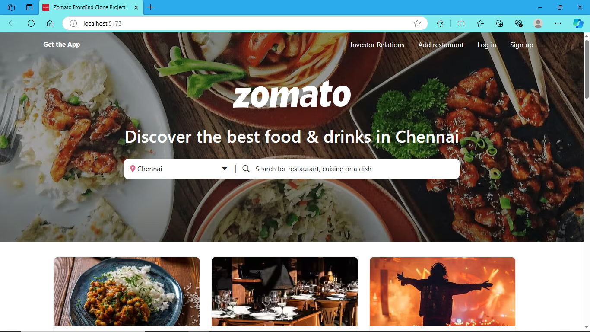
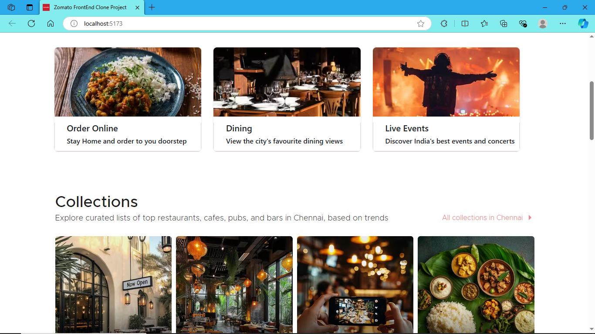
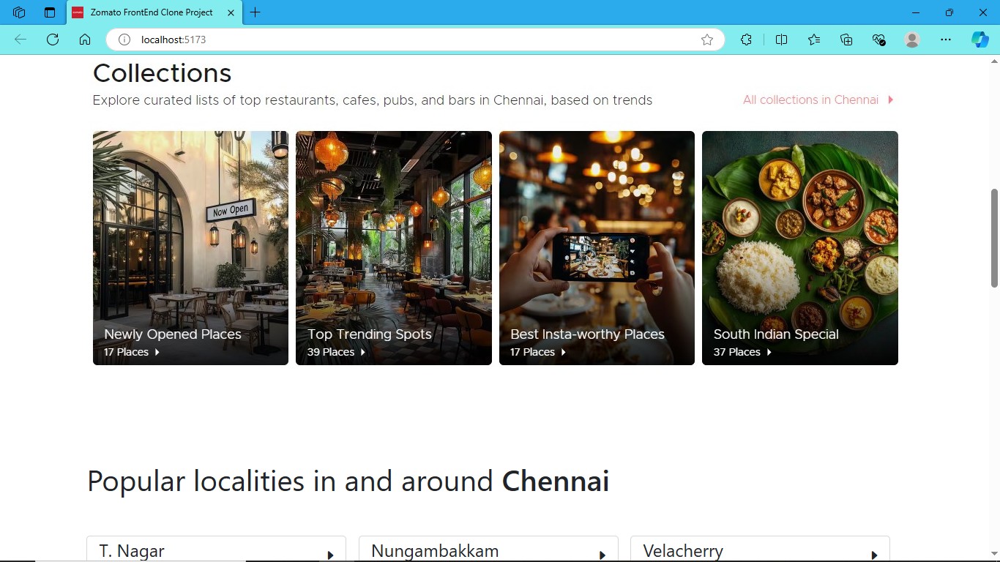
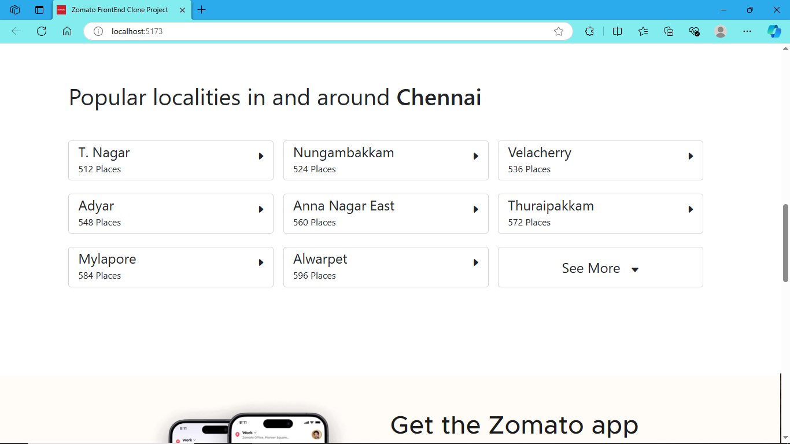
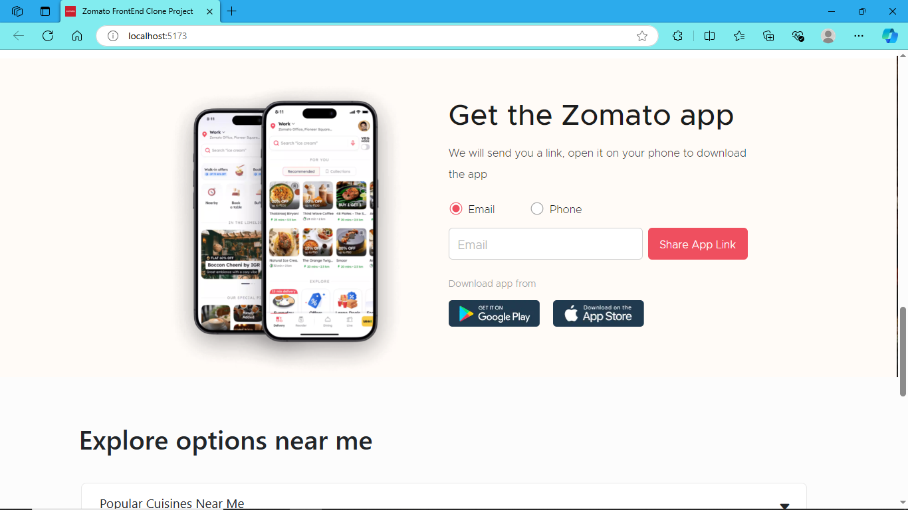
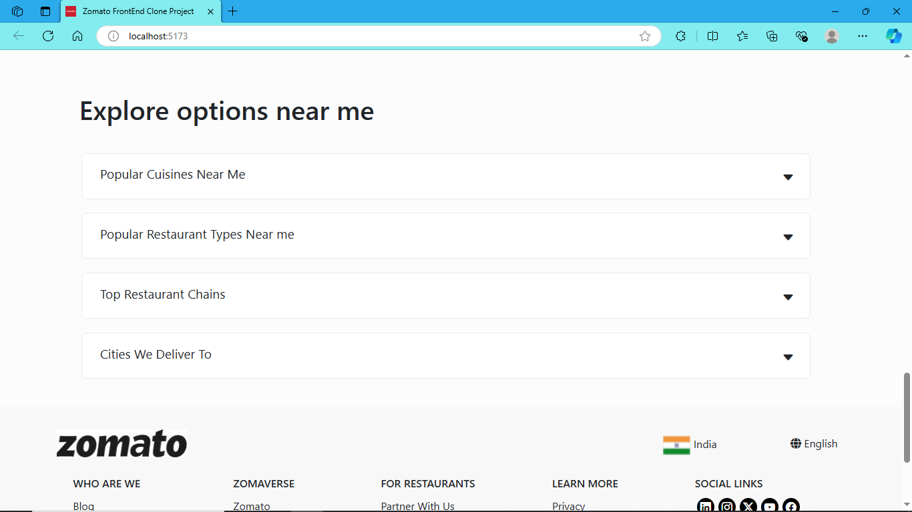
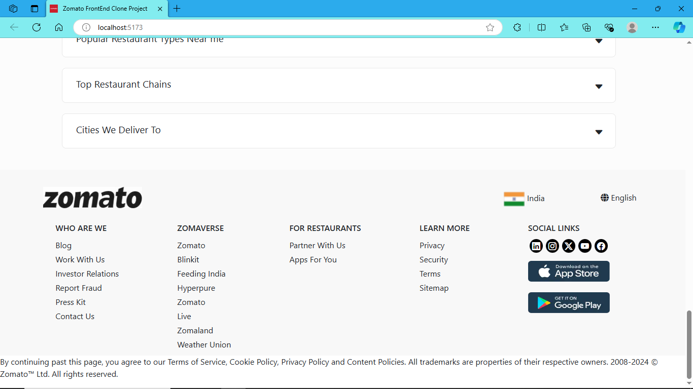

# Zomato Front-End UI Design

I have developed a **Zomato Front-End UI** using **React JS** that replicates key elements of the Zomato website. This design captures the look and feel of a modern food delivery interface with a user-friendly layout and responsive design.

### Image of the Output is attached below



<br><br>


<br><br>


<br><br>


<br><br>


<br><br>


<br><br>


<br><br>

### Video Demonstration

You can view the demonstration of the UI by clicking the link below:

[Watch the Video Demonstration](https://drive.google.com/file/d/1s2oS4TsbSRGcC4kinlBIQO0Y1cXNKmyx/view?usp=sharing)

---

### Key Features:

- **React JS Implementation**: Built using modern React JS practices for efficient and scalable UI development.
- **Dynamic Content**: Utilizes reusable components to dynamically render elements like menus, restaurant listings, and more.

### Image Sources:

- Some images used in the project are sourced from the **official Zomato website**.
- Additional images are provided by **Pexels**, a free stock photo platform.

---

### Installation and Setup

Follow the steps below to set up and run the project locally:

1. **Clone the Repository and Install Dependencies:**

   Begin by cloning the project repository, navigating to the project directory, and installing all necessary dependencies.

   ```bash
   git clone https://github.com/Jeromed28/Zomato-Front-End-Design.git
   cd ./Zomato-Front-End-Design
   npm install
   ```

2. **Run the project**

   ```bash
   npm run dev
   ```
